<!-- HEADER WAVE -->


<br/>


<div align="center">
  
</div>

<br/>


<div align="center">
  
</div>

<br/>


<div align="center">
  <a href="mailto:jjarins@outlook.com">
    
  </a>
  &nbsp;
  <a href="https://linkedin.com/in/joao-arins">
    
  </a>
  &nbsp;
  <a href="https://fractalab.studio">
    
  </a>
  &nbsp;
  
</div>

<br/>

---

<br/>

## &nbsp;About

I'm a web developer and the founder of **[Fractal Studio](https://fractalab.studio)** — a premium digital agency based in Joinville, Brazil. We build scroll-reactive, 3D-rich, cinematically animated websites benchmarked against the best studios in the world: Awwwards, FWA, Lusion, Basement.

Every project I touch gets the same treatment: intentional design, real animation, obsessive performance. I don't build templates. I build things people screenshot.

Currently available for high-end national and international projects.

<br/>

---

<br/>

## &nbsp;What I Craft

<br/>

```
AWARD-LEVEL WEBSITES       Scroll-reactive · WebGL · 3D environments · cinematic UX
IMMERSIVE EXPERIENCES      GSAP + Three.js + Lenis · canvas-based · custom cursors
PERFORMANCE WEB APPS       Next.js 15 App Router · Edge Runtime · green Core Web Vitals
DESIGN SYSTEMS             Tailwind v4 · editorial typography · token architecture
```

<br/>

---

<br/>

## &nbsp;Stack

<br/>

<div align="center">
  
</div>

<br/>

<div align="center">

| Layer | Tools |
|:--|:--|
| **Framework** | Next.js 15 · TypeScript · React 18 |
| **Styling** | Tailwind CSS v4 · CSS custom properties |
| **Animation** | GSAP 3 · ScrollTrigger · SplitType · Framer Motion |
| **Scroll** | Lenis |
| **3D / WebGL** | Three.js · React Three Fiber · Drei |
| **Forms & Email** | Resend · ImprovMX |
| **Deploy** | Vercel · Namecheap · Porkbun |
| **Other** | Python · Supabase · Figma · Midjourney |

</div>

<br/>

---

<br/>

## &nbsp;GitHub

<br/>

<div align="center">
  
  &nbsp;
  
</div>

<br/>

<div align="center">
  
</div>

<br/>

---

<br/>

## &nbsp;Trophies

<br/>

<div align="center">
  
</div>

<br/>

---

<br/>

## &nbsp;Contribution Activity

<br/>

<div align="center">
  
</div>

<br/>

---

<br/>

## &nbsp;Currently

<br/>

→ &nbsp;Running **[Fractal Studio](https://fractalab.studio)** — building premium websites across Brazil and internationally  
→ &nbsp;Exploring **WebGPU**, next-gen rendering, and cinematic scroll architectures  
→ &nbsp;Obsessing over GSAP context layering, Lenis scroll precision, and Three.js shader work  
→ &nbsp;Available for projects that deserve to win awards

<br/>

---

<br/>

<div align="center">

### Let's build something that moves people.

<br/>

<a href="mailto:jjarins@outlook.com">
  
</a>
&nbsp;
<a href="https://fractalab.studio">
  
</a>

<br/><br/>

<sub>Joinville · Santa Catarina · Brazil &nbsp;·&nbsp; Available worldwide</sub>

</div>

<br/>


